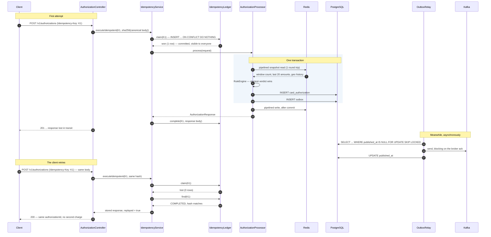

# payauth

An idempotent card authorization service with a real-time velocity and fraud rules layer, built on Java 21, Spring Boot, PostgreSQL, Kafka and Redis.

[](https://github.com/Sinha-09/payauth/actions/workflows/ci.yml)

---

## What it does

`POST /v1/authorizations` authorizes a card payment **at most once per `Idempotency-Key`**, screens it against sliding-window velocity rules held in Redis, writes the authorization and its domain event in a single transaction, and relays that event to Kafka asynchronously.

The three things it is actually about:

| Concern | Approach |
| --- | --- |
| **Duplicate requests** | A single `INSERT ... ON CONFLICT` decides ownership of a key. 50 concurrent callers produce exactly one authorization. |
| **Losing events** | Transactional outbox. The state change and the event commit together, enforced by `Propagation.MANDATORY`. |
| **Fraud checks on the money path** | Fail-open. A Redis outage allows payments and raises a metric; it never declines a cardholder. |

Monetary amounts are `long` minor units (paise, cents) everywhere — never `double`, never `float`. Even the anomaly rule's "5× the rolling average" comparison is done by cross-multiplying in `BigInteger` rather than dividing, so no floating point value ever touches the money path.

---

## Quickstart

Requires Docker. Nothing else needs to be installed to run it.

```bash
docker compose up -d --build
```

That brings up PostgreSQL, Redis, Kafka (KRaft, no ZooKeeper) and the service, runs the Flyway migrations, and creates the Kafka topic. The service is usable as soon as it reports healthy:

```bash
curl -s http://localhost:8080/actuator/health
```

### The console

Open **<http://localhost:8080>**. There is a small read-only UI there that makes the
normally-invisible parts of the system visible while you click through it: the raw
HTTP exchange with an explanation of every status code, what the fraud rules saw
for the card in the form, the outbox backlog, and live counters.

It has one-click scenarios for the four behaviours worth demonstrating — tripping
the velocity rule, impossible travel, an amount over the issuer ceiling, and **50
concurrent requests on a single Idempotency-Key**, which reports the status tally
and the number of authorization rows actually created.

The console is read-only, has no authentication, and exposes raw authorization rows
and per-card velocity state. It is for demonstrating and explaining the system.
Turn it off anywhere real:

```bash
CONSOLE_ENABLED=false docker compose up -d
```

### Idempotency, with real output

First call — `201`, and the authorization is created:

```console
$ curl -s -i -X POST http://localhost:8080/v1/authorizations \
    -H 'Content-Type: application/json' \
    -H 'Idempotency-Key: demo-2f8c1a' \
    -d '{"cardToken":"tok_4111111111111111","amountMinor":249900,"currency":"INR","merchantId":"mrc_acme_travel","countryCode":"IN"}'

HTTP/1.1 201
Location: /v1/authorizations/5839a9d8-850b-4228-b060-860fbc8591b2
Content-Type: application/json

{"authorizationId":"5839a9d8-850b-4228-b060-860fbc8591b2","status":"APPROVED","responseCode":"00"}
```

Same key, same body — `200`, and the **same** authorization id. No second charge:

```console
$ curl -s -i -X POST http://localhost:8080/v1/authorizations \
    -H 'Content-Type: application/json' \
    -H 'Idempotency-Key: demo-2f8c1a' \
    -d '{"cardToken":"tok_4111111111111111","amountMinor":249900,"currency":"INR","merchantId":"mrc_acme_travel","countryCode":"IN"}'

HTTP/1.1 200
Content-Type: application/json

{"authorizationId":"5839a9d8-850b-4228-b060-860fbc8591b2","status":"APPROVED","responseCode":"00"}
```

Same key, **different** body — `409`, because guessing which response the client wants is not an option:

```console
$ curl -s -X POST http://localhost:8080/v1/authorizations \
    -H 'Content-Type: application/json' \
    -H 'Idempotency-Key: demo-2f8c1a' \
    -d '{"cardToken":"tok_4111111111111111","amountMinor":999900,"currency":"INR","merchantId":"mrc_acme_travel","countryCode":"IN"}'

{"type":"https://payauth.shivamsinha.com/problems/idempotency-key-reused",
 "title":"Idempotency conflict","status":409,
 "detail":"Idempotency-Key 'demo-2f8c1a' was already used with a different request body.",
 "instance":"/v1/authorizations","reason":"REQUEST_MISMATCH","retryable":false}
```

And the event makes it all the way through the outbox to the consumer:

```console
$ docker compose logs app | grep "Authorization event received"
payauth-app | AuthorizationEventConsumer : Authorization event received:
  id=5839a9d8-850b-4228-b060-860fbc8591b2 merchant=mrc_acme_travel
  amountMinor=249900 INR status=APPROVED code=00
```

`make smoke` runs all three of those calls in order.

---

## API

```
POST /v1/authorizations
  Header: Idempotency-Key   (required; 400 if absent, max 64 chars)
  Body:   { cardToken, amountMinor, currency, merchantId, countryCode? }

  201  the authorization was created by this call
  200  a stored response, replayed for a key that already completed
  400  validation failure, or a missing Idempotency-Key
  409  the same key with a different body, or a concurrent call holding the key

GET  /v1/authorizations/{id}
POST /v1/authorizations/{id}/capture   optimistic locking; 409 on a concurrent modification
POST /v1/authorizations/{id}/void
```

Every error is RFC 7807 `application/problem+json` with a stable `type` URI per failure mode, so a client can branch on the failure without parsing prose.

Response codes are real ISO 8583 field 39 values:

| Code | Meaning | When |
| --- | --- | --- |
| `00` | Approved | The rules allowed it, or flagged it for offline review |
| `05` | Do not honour | A velocity rule returned DECLINE |
| `51` | Insufficient funds | Above the configured issuer ceiling |

A **declined authorization is a successful API call with a bad answer**, so it is still `201` with `"status":"DECLINED"` in the body. That is how card authorization works, and collapsing it into an HTTP error would lose the authorization record.

---

## The retry path

This is the sequence the whole design exists to get right: a client whose first request succeeded but whose response was lost, retrying.



If the retry arrives while the first call is still running, the ledger row is `IN_PROGRESS` and the client gets `409` with `"retryable": true` rather than a duplicate authorization.

---

## Design decisions

### Why an outbox instead of a dual write?

A dual write is "commit to Postgres, then publish to Kafka". There is no ordering of those two operations that is correct.

Publish first and the process can die before the commit: consumers act on an authorization that does not exist. Commit first and the process can die before the publish: the money moved and nothing downstream knows. The failure is not rare — it is every deploy, every OOM kill, every pod eviction, at whatever rate your traffic makes those happen.

The outbox removes the second write from the critical path entirely. The event is a row in the same database, inserted in the same transaction as the authorization, so "this happened" and "this will be announced" are the same atomic fact. A separate relay moves rows to Kafka afterwards, and because it can only ever be behind — never wrong — the worst case is delay rather than divergence.

The cost is real and worth naming: delivery becomes at-least-once, so every consumer needs to be idempotent, and there is now a table that grows and a relay that can lag. Both are things you can monitor. A dual write's failure mode is silent data loss, which is not.

In this codebase the guarantee is structural rather than conventional. `OutboxWriter.append` is `Propagation.MANDATORY`: it cannot execute outside a caller's transaction. Delete the `@Transactional` on `AuthorizationProcessor.process`, or move the outbox write to a caller that has no transaction, and the application throws `IllegalTransactionStateException` on the first request instead of quietly becoming a dual write again.

### Why `ON CONFLICT DO NOTHING` instead of `SELECT ... FOR UPDATE`?

Both give you mutual exclusion. They differ in what happens to the losers.

`SELECT ... FOR UPDATE` needs a row to lock, so the sequence is read, then insert if absent — and between those two statements another transaction can insert the same key. Closing that hole means either a lock on something that already exists, or catching the unique violation anyway, at which point the `SELECT` was decoration. Worse, whoever holds the lock holds it for the whole authorization: the downstream call, the Redis read, the flush. Every duplicate request blocks on a database connection for that entire time, and a burst of retries — exactly what happens during an incident — exhausts the pool. The idempotency layer becomes the outage.

`INSERT ... ON CONFLICT` is one statement. Postgres resolves it against the primary key index atomically, so there is no window to race in, and the losers find out immediately with zero rows affected instead of waiting. Fifty concurrent callers produce one winner and forty-nine instant answers.

The extension used here is `ON CONFLICT (key) DO UPDATE ... WHERE idempotency_key.expires_at < now`, which handles expiry in the same statement: an expired row is overwritten in place, because a second `INSERT` for the same primary key is not available.

The trade-off is that the losers get told `409 in progress` rather than silently waiting for the winner's answer. That is a deliberate choice — a fast, honest, retryable answer beats an open connection — and clients are told `"retryable": true` so they know it.

### Why `long` minor units instead of `BigDecimal` or `double`?

`double` is disqualified immediately: `0.1 + 0.2` is not `0.3` in binary floating point, and a payment system that cannot add two amounts is not a payment system.

`BigDecimal` is exact, so the real argument is against it, and it is about a scale that has to be right rather than an arithmetic that has to be right. `BigDecimal` carries a scale, and `1.50` and `1.5` are `equals`-unequal while being `compareTo`-equal — a distinction that produces bugs in maps, sets and assertions, at a distance from where it was introduced. It also has to be serialized somewhere, and JSON's number type is a double in most parsers, so `19.99` can survive four hops and arrive as `19.989999999999998`.

Minor units sidestep all of it. `1999` is an integer. It is exact in every language, every database, every JSON parser and every wire format. It compares with `==`, it sums without a rounding policy, and it fits in a `long` with room to spare — `Long.MAX_VALUE` paise is about 92 quadrillion rupees. It is also what ISO 8583 and every card network actually put on the wire, so the domain model matches the protocol instead of translating to it.

The discipline it demands is that presentation is the only place a decimal point appears, and that the currency's exponent (2 for INR and USD, 0 for JPY, 3 for BHD) lives with the formatter. The one place this codebase needed a ratio — the anomaly rule's "5× the rolling average" — is done by cross-multiplying in `BigInteger` rather than dividing, so even the comparison stays exact.

### Why fail-open on Redis?

Because the alternative is worse, and the asymmetry is not close.

Fail closed and a Redis outage declines 100% of authorizations. Every cardholder, every merchant, for the duration. That is a total outage of the product, caused by a component that is advisory — the velocity layer's job is to catch a minority of transactions, and it is wrong about some of those.

Fail open and the same outage means fraud screening is off for a few minutes. Some fraudulent transactions get through. Those losses are bounded, quantifiable, chargeable back, and in most cases insured. The cost of declining every good customer is none of those things: it is lost revenue, merchant churn, and a support queue, and the merchants who leave do not come back when Redis does.

So the rule is that nothing in the fraud layer may decline a payment by failing. `RuleEngine` catches `RuntimeException` broadly on purpose — the guarantee is "no failure in here can decline a payment", and a narrower catch would quietly turn into a promise about which exceptions Lettuce throws. A rule that throws is contained the same way, so one bad rule cannot take the others, or the payment, with it.

What makes this safe rather than negligent is that failing open is never silent. Every occurrence increments `payauth.velocity.fail_open` and logs at WARN, and the evaluation is marked `degraded`. Without that, the only symptom of a fraud outage is a decline rate that quietly goes to zero — which nobody alerts on until the chargebacks arrive.

---

## Load test

```bash
make up
make load-test              # or: make load-test VUS=100 DURATION=5m
```

The script mixes new keys, exact replays of keys that already completed, and key reuse with a different body, because retries are the normal case in payments and a benchmark that only sends unique keys never measures the path that actually matters.

**50 VUs, 90s, full stack in Docker Compose on an M-series MacBook Pro. Not a production benchmark — everything, including the load generator, is on one laptop.**

| operation | p50 (ms) | p95 (ms) | p99 (ms) |
| --- | --- | --- | --- |
| create (201) | 39.5 | 116.6 | 170.8 |
| replay (200) | 15.7 | 70.7 | 113.5 |

76,011 iterations over 90 seconds — about 840 req/s — with 63,170 created, 11,288 replayed, 1,553 conflicts correctly refused, 2,781 declined by velocity rules, and **0 unexpected responses**.

The replay path being roughly 2.5× faster than the create path is the shape you want: a retry costs one indexed primary key lookup and a JSONB read, with no rule evaluation, no insert and no outbox write.

---

## Running the tests

```bash
make test      # or: ./mvnw verify
```

76 tests. Requires Docker and a JDK 21.

Integration tests use Testcontainers with real PostgreSQL, Redis and Kafka rather than mocks, because the behaviour being tested — `ON CONFLICT` semantics, transaction visibility across concurrent connections, `FOR UPDATE SKIP LOCKED`, optimistic locking — is behaviour of the database. A mocked repository would only assert that the code's assumptions are internally consistent, which is exactly the thing worth doubting.

The velocity rules, by contrast, are pure functions of a snapshot and a config, so they are unit tested with no container at all. That is a property of the design, not a testing trick: rules receive a `VelocitySnapshot` and have no access to Redis, which is also why "one round trip per authorization" cannot regress.

Worth reading for how the hard parts are pinned down:

- `IdempotencyIntegrationTest` — 50 threads released together on a `CountDownLatch` against one key, asserting exactly one authorization row; expiry driven by an injected mutable clock rather than a sleep
- `OutboxIntegrationTest` — a relay killed mid-batch, restarted, and shown to redeliver without producing a duplicate authorization or a duplicate downstream effect
- `VelocityFailOpenIntegrationTest` — Redis pointed at a dead port; payments still work

---

## Layout

```
src/main/java/com/shivamsinha/payauth/
├── api/          controllers, DTOs, RFC 7807 exception handling
├── console/      read-only endpoints behind the demo UI (disable in production)
├── config/       @ConfigurationProperties, Kafka topic and template, Clock
├── domain/       JPA entities and enums
├── repository/   Spring Data repositories, including the native ON CONFLICT
│                 and FOR UPDATE SKIP LOCKED statements
├── service/      idempotency ledger, canonical hashing, the authorization
│                 processor that owns the transaction boundary
├── outbox/       event, writer, relay, consumer
└── velocity/     rule engine, pipelined Redis access, hot-reloadable config
    └── rules/    the three rules
```

Constructor injection throughout, no field `@Autowired`, no Lombok — the generated code should be readable in a review without a plugin.

Every schema change is a Flyway migration and `ddl-auto` is `validate`, never `update`. Hibernate's job is to refuse to start if the mapping and the migrated schema disagree, not to invent DDL.

---

## Configuration

Everything below has a working default; the compose file only overrides connection details.

| Property | Default | What it controls |
| --- | --- | --- |
| `payauth.idempotency.ttl` | `24h` | How long a completed key stays replayable |
| `payauth.idempotency.in-progress-timeout` | `30s` | When an abandoned claim may be taken over |
| `payauth.outbox.relay.fixed-delay` | `500ms` | How often the relay drains |
| `payauth.outbox.relay.batch-size` | `100` | Bounded, because the batch is one transaction |
| `payauth.velocity.enabled` | `true` | Master switch for the fraud layer |
| `payauth.velocity.rules-file` | `classpath:rules.yml` | Point at a `file:` location for hot reload |
| `payauth.velocity.refresh-interval` | `10s` | How often the rules file is re-read |
| `payauth.issuer.decline-above-minor` | `10000000` | Stand-in issuer ceiling; above it, ISO 8583 `51` |
| `payauth.console.enabled` | `true` | The demo UI and its read endpoints. Set `false` in production. |

`rules.yml` is re-read on that interval and swapped as a single reference, so an evaluation in flight sees the whole old configuration or the whole new one, never a half-applied mixture. A malformed file is logged and discarded and the last good configuration stays in force — operators tune these thresholds under pressure, and a YAML typo must not be able to change how payments are screened.

Metrics are on `/actuator/prometheus`. The ones worth alerting on: `payauth.velocity.fail_open`, `payauth.outbox.publish_failed`, `payauth.idempotency.takeover`, and the age of the oldest unpublished outbox row.

---

## What I would do differently at scale

**The relay is the first thing to break.** A single `@Scheduled` method polling every 500ms is fine at hundreds of requests per second and will not survive tens of thousands. `FOR UPDATE SKIP LOCKED` already lets instances run in parallel, so horizontal scaling works, but every instance is still polling a table on a timer. At real volume I would replace it with change data capture — Debezium reading the Postgres WAL — which removes the polling entirely, removes the `UPDATE` per published row, and cuts publish latency from "up to one poll interval" to "as fast as the WAL is read". The outbox table becomes append-only and gets partitioned by day and dropped rather than swept.

**The idempotency table needs a retention story before it needs anything else.** At 10k/s a 24-hour TTL is roughly 900 million rows. `deleteExpired` is a single unbounded `DELETE` that would lock and bloat; it should be a batched sweep over a partitioned table, or ideally daily partitions that get dropped. Dropping a partition is a metadata operation. Deleting 900 million rows is an incident.

**Redis is a single point of degradation, which is only acceptable because it fails open.** For real traffic: Redis Cluster with the card token as the hash key so a card's keys stay co-located and pipelining still works, plus a short-lived local cache to absorb the hottest cards. I would also revisit the sorted set — at high volume a probabilistic counter costs a fraction of the memory, and the velocity rule does not need exactness, it needs "more than five".

**The issuer call is missing, and it is the thing that would change the latency profile most.** A real authorization is dominated by a network round trip to the issuer, not by anything in this process. That means a bulkhead per issuer, a circuit breaker, and a timeout budget that is smaller than the client's — plus a reversal path, because a timeout is not a decline and the network may have authorized what you just told the merchant failed. That last case is where an idempotency layer earns its keep, and it is the part this project models but does not yet exercise.

**Rules should not be code.** Three hardcoded `@Component` rules is right for a project this size and wrong for a fraud team that ships changes daily. At scale this becomes a rules DSL or a decision-table service, versioned, with shadow evaluation so a new rule runs against live traffic and reports what it *would* have done before it is allowed to decline anything.

**Observability would move from metrics to decisions.** Counters tell you the decline rate changed; they do not tell you why. Every evaluation should emit its per-rule verdicts and the snapshot it saw, so a disputed decline can be reconstructed exactly — which is also what a regulator asks for.

**Operationally**: read replicas for `GET`, `PgBouncer` in transaction mode ahead of Postgres, partitioning by month on `card_authorization`, and a `Retry-After` on the `409 in progress` response so retry storms have a slope instead of a cliff.

---

## Notes on a few things that look odd

- **The table is `card_authorization`, not `authorization`.** `AUTHORIZATION` is a reserved word in PostgreSQL. The JPA entity is still `Authorization`.
- **`apache/kafka:4.0.0`, not `3.9.0`.** On 3.9.0 the image formats storage before Testcontainers has written the advertised listeners, and the broker dies with *"advertised.listeners cannot use the nonroutable meta-address 0.0.0.0"*.
- **Testcontainers is pinned to 1.21.4.** Earlier versions ship a `docker-java` that negotiates API version 1.32, which Docker Engine 29 rejects with a 400 that surfaces as the unhelpful *"Could not find a valid Docker environment"*.
- **`AuthorizationProcessor` is its own bean, not a private method.** It is invoked through a `Supplier` handed to `IdempotencyService`. As a private method it would be a self-invocation, Spring's proxy would never see it, and `@Transactional` would silently do nothing — which is the classic way this pattern is got wrong.
